= Ecrire de la documentation pour un projet libre
:author: Fabrice Flore-Thebault <fab@centsix.org>
:version: Jeudis du Libre de Bruxelles
:date: jeudi 6 octobre 2011
:lang: fr
// :max-width: 45em
:data-uri:
// :backend: deckjs
// :deckjs_theme: neon
// :deckjs_transition: horizontal-slide
// :pygments:
// :pygments_style: native
// :scrollable:
// :count_nested:

:backend: revealjs
:icons: font
:revealjs_slideNumber: true
:revealjs_theme: league
:source-highlighter: highlightjs
:revealjs_width: 1920
:revealjs_height: 1080
:toc: preamble

https://themr0c.github.io/2011-10-06-jeudisdulibre-bruxelles

Jeudis du libre de Bruxelles, 2011-10-06.

== L'auteur: Fabrice Flore-Thébault http://identi.ca/themr0c[@themr0c]

Partout où il faut documenter les projets, les processus, les infrastructures.

////
["graphviz", "author.svg", "dot", "svg"]
----
digraph author{
node [shape=Mrecord, style=filled, color="#6699ff", fillcolor="#ececff"]; 
FFT [label="Fabrice Flore-Thébault (@themr0c)" URL="http://identi.ca/themr0c"] ;
Doc [label="Documentation, Processus, QA"]
Libre [label="Projets libres"];
CHJT [label="Centre hospitalier Jean Titeca"];
FFT -> {Libre Consultant Doc Sysadmin};
Libre -> {GLPI Rudder};
Consultant -> {Esquimaux Centsix};
Esquimaux -> CHJT;
Centsix -> Normation -> Rudder;
Doc -> {Emakina Mediaxim GLPI CHJT Rudder Centsix};
Sysadmin -> {Emakina Mediaxim CHJT};
}
----
////

== La documentation utilisateur

[role="incremental"]

* Circulation de la connaissance.

* Permettre à des personnes extérieures au projet d'utiliser l'outil produit.

* Donner du sens et expliciter les intentions.

* Libérer de l'espace de support.
+
____

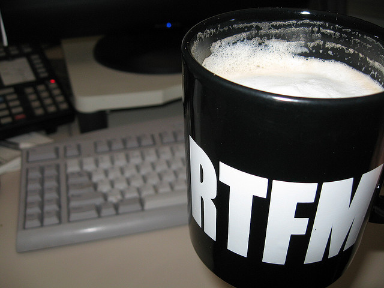

credit cc-by-sa @bike http://www.flickr.com/photos/bike/2263136517/

____

== Approche traditionnelle

=== Traitement de texte et outils de PAO

[role="incremental"]

* WYSIWYG => WYGIWYS What you get is what you see

* Pas de structure

* Pas d'historisation

=== Rédacteur isolé des développeurs

[role="incremental"]

* Pas de correction de l'application

* Capture d'écran vs. dynamique d'utilisation

* Procédure vs. intention

== Faire appel à un rédacteur technique

[role="incremental"]

* Un non développeur dans une équipe de développeurs.

* Choc culturel.

* Nécessaire adaptation réciproque.
+
____
Comment, quelqu'un qui ne lit pas le code ?

image::images/code.png["Ne pas lire le code"]

credit: cc-by @scruch http://www.flickr.com/photos/81655050@N00/4247848460
____

== Implication des autres acteurs du projet

.Jeu des questions-réponses.
====
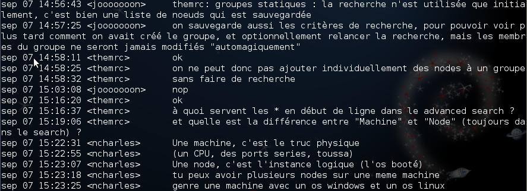
====

== Les objectifs humains

=== S'adapter aux autres acteurs du projet

[role="incremental"]

- Une composante du projet comme les autres.

- Traiter la documentation comme le reste du code.

- Permettre aux contributeurs d'utiliser leurs outils habituels.

=== Faciliter la vie des auteurs

[role="incremental"]

- Simplicité pour l'auteur (outil, syntaxe).

- Ne pas imposer un outil d'édition.

- Pouvoir travailler à plusieurs.

- Pouvoir travailler offline.

== S'adapter au projet

. Contrôle de version
. Gestion de projet
. Intégration continue
. Accessibilité immédiate
. Environnement de travail

== Contrôle de version

Utiliser le même outil de gestion de version que le reste du projet.

.Visualisation des activités Git avec Gitorious
====
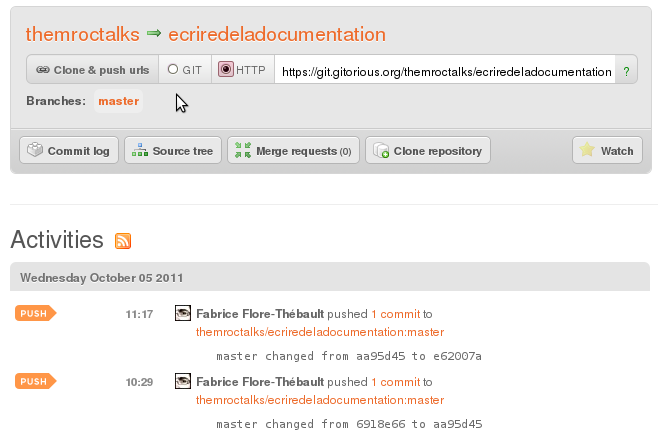
====

== Gestion de projet

Intégration à la forge du reste du projet.

.Intégration à Redmine avec Git
====
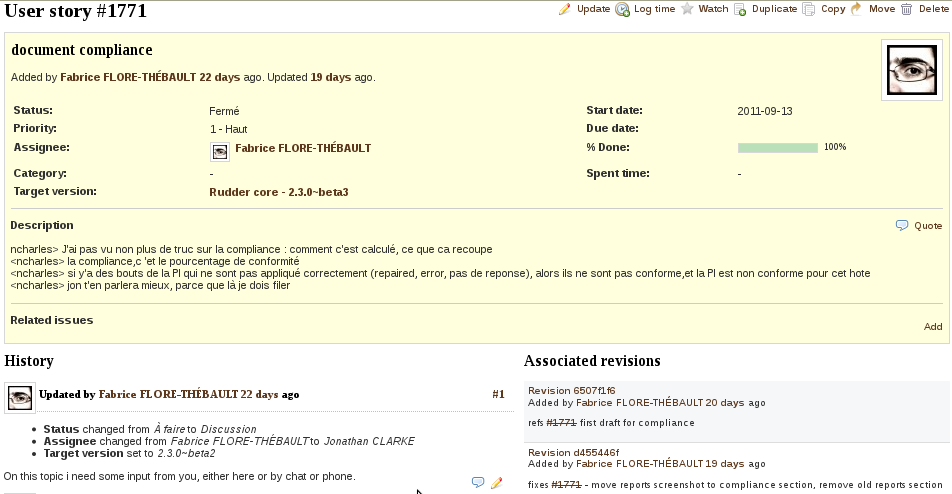
====

== Intégration continue

Utiliser le même outil d'intégration continue que le reste du projet.

Déploiement continu : validation de la publication, mieux qu'un CMS !

.Intégration continue avec Jenkins, utilisation de Makefile
====
image::images/ci.png["Intégration continue avec Jenkins"]
====

== Edition rapide

Un outil simple pour de petites modifications.

.Edition en ligne avec Github
====
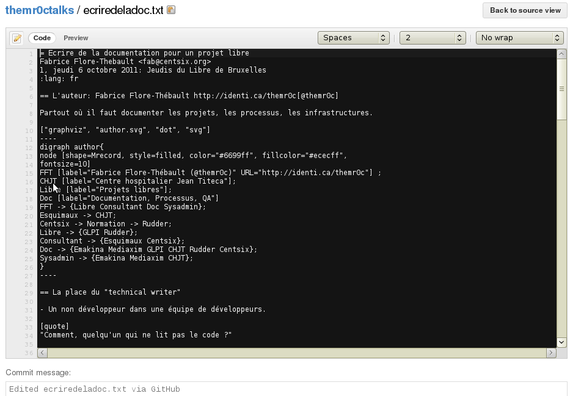
====

== Votre éditeur de texte habituel

Utiliser votre éditeur de texte préféré.

.Un fichier asciidoc dans Vim
====
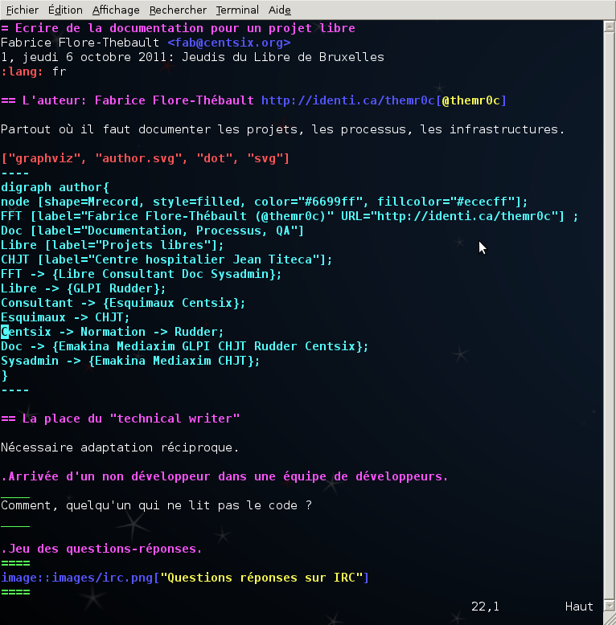
====

== Choix de la chaîne de production

.La chaîne de production est centrée sur les formats d'édition et de publication.
["graphviz", "workflow.svg", "dot", "svg"]
----
digraph workflow{
node [shape=Mrecord, style=filled, color="#6699ff", fillcolor="#ececff"]; 
FormatE [label="Format d'écriture"];
OutilsE [label="Outils d'édition"]; 
FlowE [label="Flux de production"];
FormatP [label="Formats de publication"];
OutilsP [label="Outils de publication"];
FlowP [label="Chaîne de publication"];
FormatE -> OutilsE -> FlowE;
FormatE -> FormatP -> OutilsP -> FlowP;

}
----

== Formats de publication

Deux cibles : le web et l'impression papier.

.Formats de publication standards.
["graphviz", "publicationformats.svg", "dot", "svg"]
----
digraph workflow{
node [shape=Mrecord, style=filled, color="#6699ff", fillcolor="#ececff"]; 
FormatP [label="Formats de publication"];
FormatP -> {Web Papier Console};
Web -> XHTML;
Papier -> PDF;
Console -> "Man pages";
}
----

== Format pour le web: HTML

.Version Web de la documentation utilisateur de Rudder
====
image::images/rudderwebdoctitle.png["Rudder documentation"]
====

== Format pour l'impression: PDF

.Version PDF de la documentation utilisateur de Rudder
====
image::images/rudderpdf.png["Rudder documentation"]
====

== Prérequis pour les formats et outils d'édition

=== Structuration

[role="incremental"]

* Séparation style et contenu.

* Une source, plusieurs formats de publication.

* Écriture sémantique vs. machine à écrire.

=== Maintenable comme du code.

[role="incremental"]

* Versionné.

* Gestion des conflits d'édition concurrente.

=== Simplicité de la rédaction

[role="incremental"]

* Simplicité de la syntaxe vs. richesse des fonctionnalités.

* Simple éditeur de texte vs. outil propriétaire. 

== Formats et outils d'édition standards

=== La sémantisation du contenu

* Applications web.
* OpenDocument.
* LaTeX.
* XML: Docbook, Dita.
* Simple markup: reStructured text, asciidoc.

=== Les illustrations

* Captures d'écran (avec parcimonie).
* Graphiques sémantiques: graphviz.

== Applications web, CMS, Wiki

===  Un outil d'appoint ponctuel appréciable, pas l'outil de travail habituel.

[role="incremental"]

* Online & synchrone vs offline & asynchrone
+
____
Ma page n'a pas été sauvegardée!
____

* Pénible gestion d'édition concurrente.

* Pas adapté au format papier. Les exports PDF ne sont qu'un pis aller.

* Formats de balisage simple: ReStructured Text, Markdown, Textile.

* Rarement intégré aux outils habituels du projet.

.Le wiki de Redmine
====
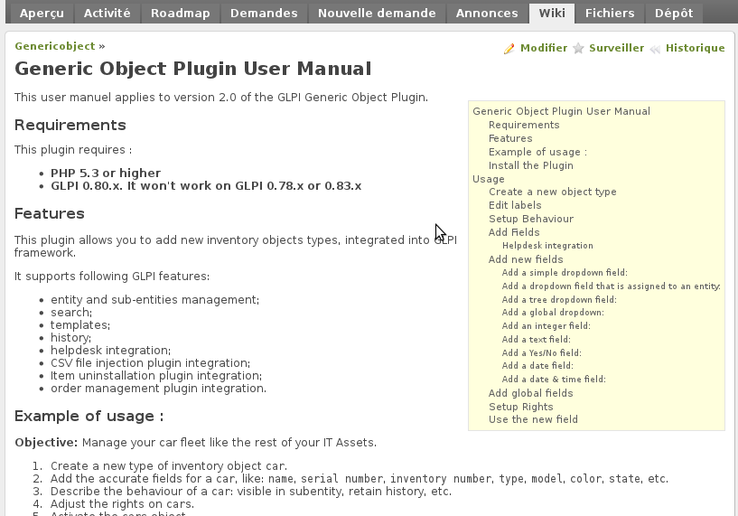
====

== Choix des outils : Opendocument et outils de PAO

===  Pas un format d'édition maintenable.

[role="incremental"]

- Impose un outil d'édition lourd.

- Pas d'édition concurrente.

- Pénible à versionner.

- Non adapté à la séparation du style et du contenu.

- La création de templates de mise en forme ne résout pas les problèmes.

.Le WYSYWIG par LibreOffice
====
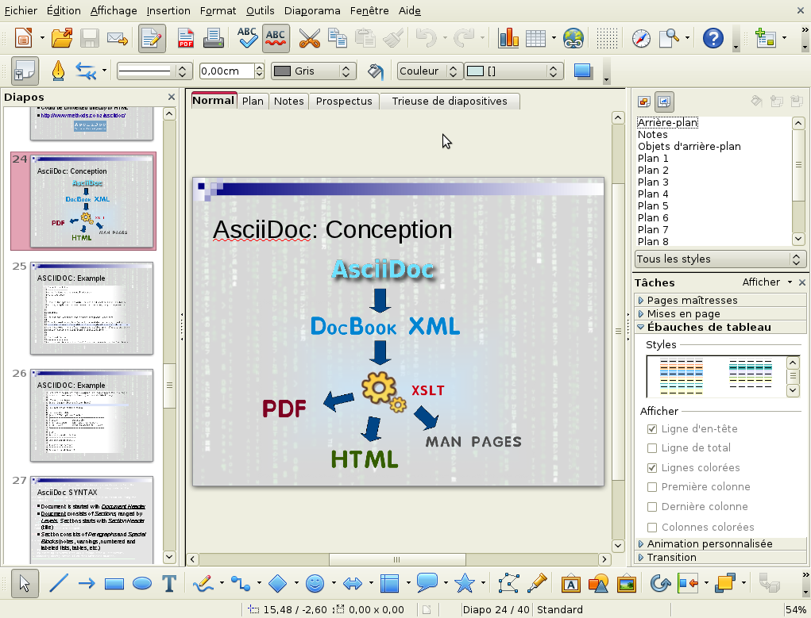
====

== LaTeX 

===  L'incontournable format intermédiaire pour produire le format imprimable

* Stabilité et qualité exemplaire.

* Syntaxe pénible pour l'auteur.

* Impose de facto l'utilisation d'un éditeur spécialisé.

.LaTeX est complexe pour les auteurs
====
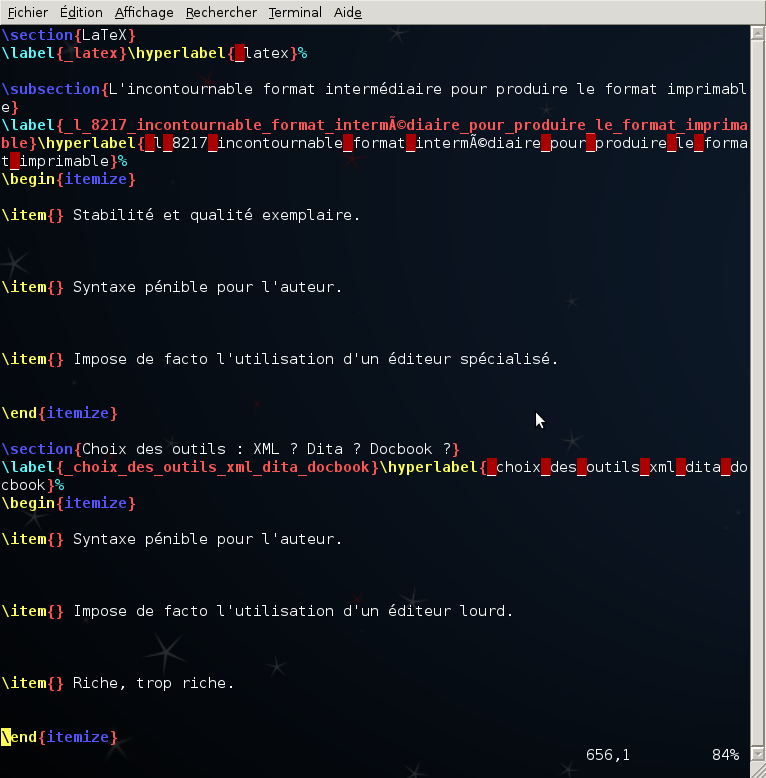
====

== Choix des outils : XML ? Dita ? Docbook ?

* Structuré, versionnable, réutilisable.

* Notions clés: +topic+, +ditamap+.

* Syntaxe pénible pour l'auteur.

* Impose de facto l'utilisation d'un éditeur lourd.

* Riche, trop riche.

.DITA est complexe pour les auteurs
====
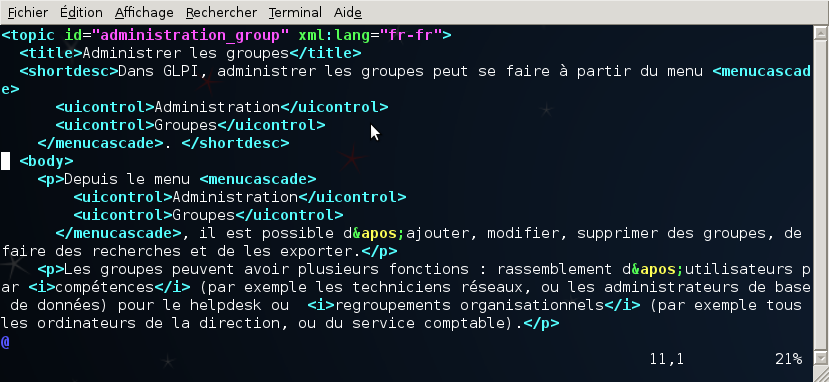
====

== Serna, éditeur libre pour DITA

* Seul éditeur libre

* Usine à gaz

* Maintenu ? 

* Disponible pour votre OS ?

====
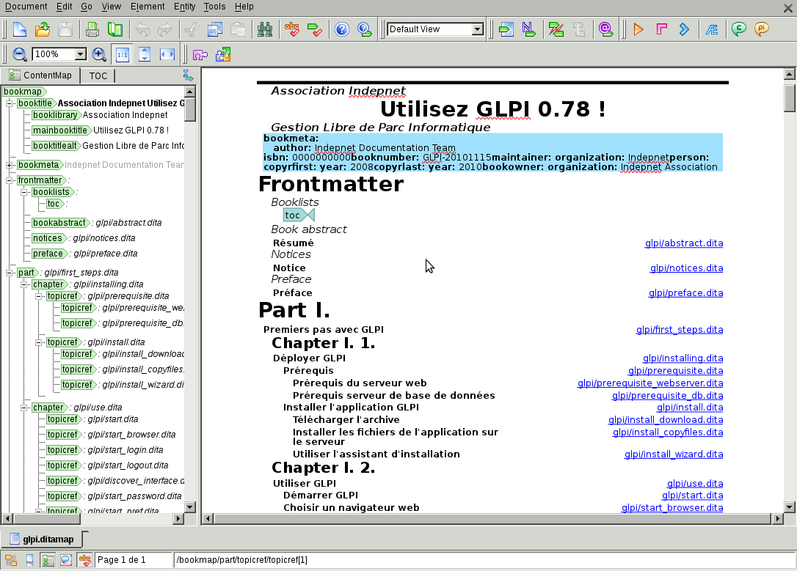
====

== Docbook

* Structuré, versionnable.

* Un bon format intermédiaire.

* Usage répandu.

.Docbook est complexe pour les auteurs
====
image::images/docbook.png["Un morceau de Docbook"]
====

== Langages de markup simple : Asciidoc

- Structuré, versionnable, réutilisable.

- Syntaxe simple pour l'auteur.

- Chaîne basée sur Docbook et LaTeX.

- Support de Graphviz.

.Chaîne de publication basée sur le format Asciidoc
["graphviz", "asciidoc.svg", "dot", "svg"]
----
digraph asciidoc{
node [shape=Mrecord, style=filled, color="#6699ff", fillcolor="#ececff"]; 
asciidoc [label="asciidoc + graphviz + png"];
xhtml [label="xhtml + svg + png"];
docbook [label="docbook + svg + png"];
latex [label="latex + pdf + png"];
pdf [label="pdf"];
asciidoc -> {docbook xhtml};
docbook -> latex -> pdf;
}
----

== Mise en oeuvre de Asciidoc

* Feuille de style pour la sortie XHTML.

* Feuille de style pour la sortie PDF.

* Structuration du texte.

* Structuration en fichiers.

* Automatisation : Makefile, scripts.

.Documentation de Asciidoc
====
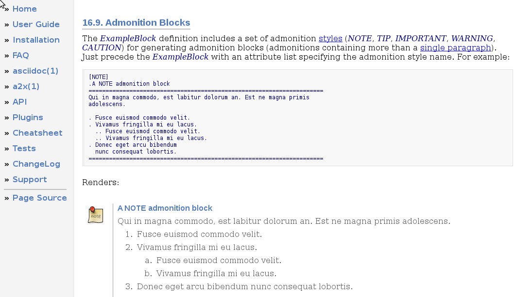
====

== La syntaxe asciidoc

.La syntaxe asciidoc
[source,shell]
----
= Titre
Nom Auteur <email@auteur.tld>
v1.0, octobre 2011: Remarque sur la version

== Section
=== Sous-section
Ceci est du contenu.

* Liste à puces
* Liste à puces

.Titre pour un exemple
====
Ceci est un exemple
====

.Titre pour une image
image::images/illustration.png[]

----

== Structuration du texte avec Asciidoc

.Sémantisation en sections, notes, code
====
image::images/asciidocexample.png["exemple de fichierAsciidoc"]
====

== Découpage en fichiers, génération du document maître

.Utilisation de scripts externe et d'inclusions
====
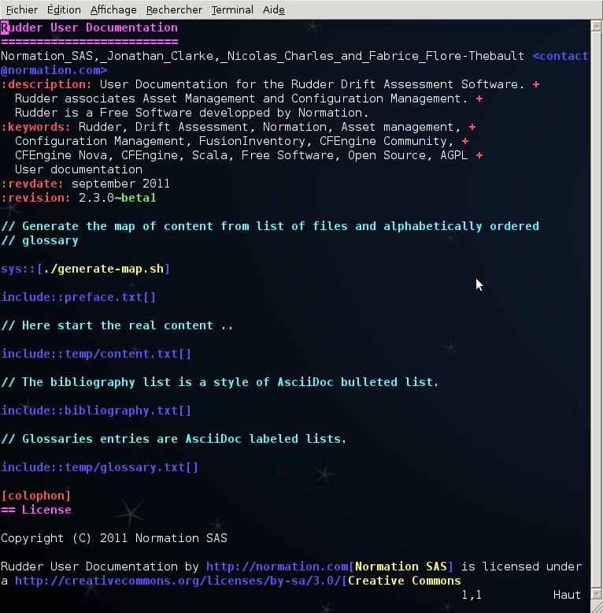
====

== Organisation d'un projet en Asciidoc

.Organisation des fichiers de la documentation de Rudder
[source,shell]
----

include::rudderdoctree.txt[]

----

== Organisation d'un projet DITA

.Organisation des fichiers de la documentation de GLPI
[source,shell]
----

include::glpidoctree.txt[]

----

== Conclusion : L'impact qualité  pour le projet

=== Rapports de bugs

- Regard extérieur.

- Tests extensifs de l'application.

=== Ergonomie

- Une interface ergonomique demande moins d'explications.

- Modification de l'interface utilisateur.
