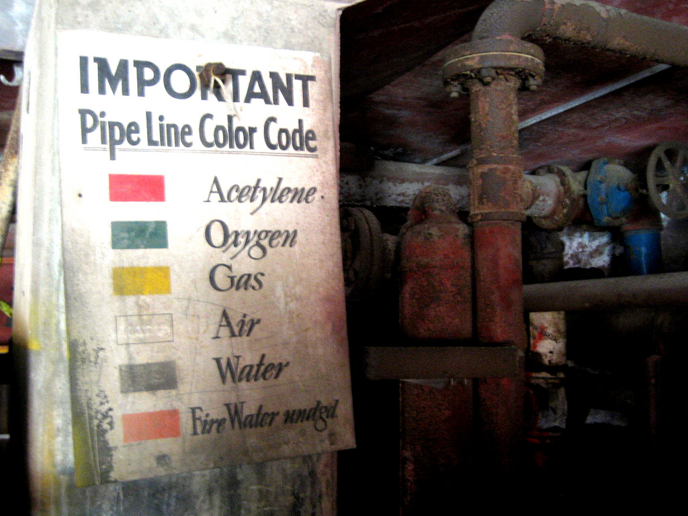
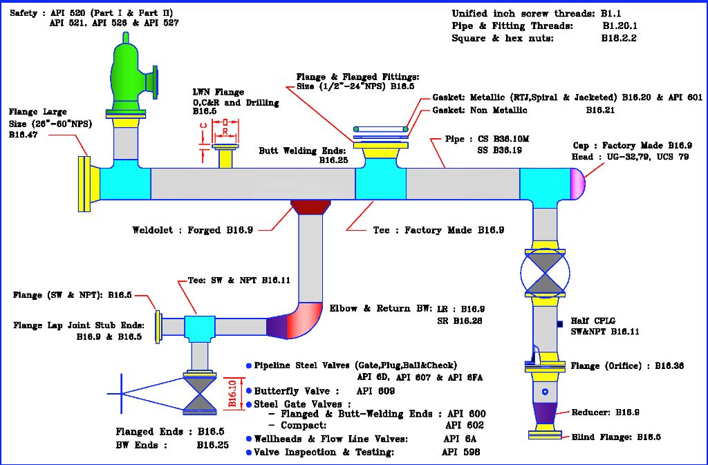
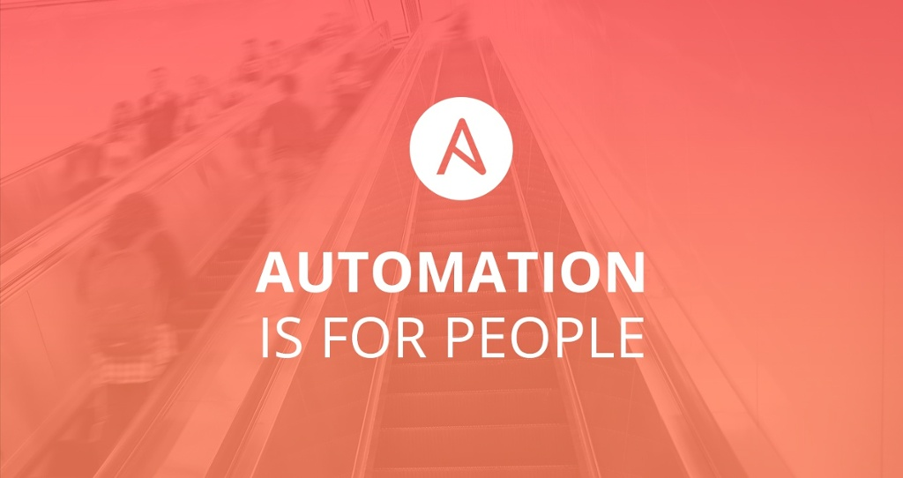
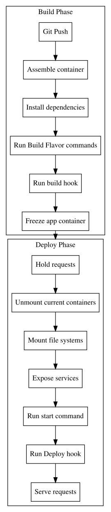

= Pipeline as Code
:author: Fabrice Flore-Thébault
:email: fab@centsix.org
:revdate: 2017-03-30
:revnumber:  0.1
:data-uri:
// // :max-width: 45em
// :backend: deckjs
// //:deckjs_theme: web-2.0
// ///////////////////////
// 	Themes that you can choose includes:
// 	web-2.0, swiss, neon beamer
// ///////////////////////
// :deckjs_theme: neon
// :deckjs_transition: horizontal-slide
// :pygments:
// //:pygments_style: native
// :pygments_style: native
// :scrollable:
// :count_nested:

:backend: revealjs
:icons: font
:revealjs_defaultTiming: 60
:revealjs_slideNumber: true
:revealjs_theme: league
:source-highlighter: highlightjs
:revealjs_width: 1920
:revealjs_height: 1440

https://themr0c.github.io/pipeline-as-code-2017
Brussels, 2017-03-30.

== About me

- Free software enthusiast
- Professional life as sysadmin / devops in SME
- Once upon a time cofounder of `Jeudis du Libre` in Brussels
- Kayaker

== Topics

- Pipeline as Code conceptual overview
- Jenkins Declarative Pipeline overview
- To Pipeline as Code (or not) in the CI/CD landscape
- Jenkins onboarding
- Declarative Pipeline syntax and examples
- Scripted Pipeline syntax and examples

.Image source: https://jenkins.io/blog/2017/03/24/jenkins-community-survey/
image::inspiration/jenkins/2016-survey-mission-critical.png[]

== 2016 Jenkins community survey results

.Image source: https://jenkins.io/blog/2017/03/24/jenkins-community-survey/
image::inspiration/jenkins.io/files/2016-jenkins-community-survey.png[]

== Pipelines color as code ... learn from the metaphor

- Signalisation of realworld enginering pipelines is codified.

.Image source: https://www.flickr.com/photos/telstar/4883861519

== Pipelines elements as code ... learn from the metaphor

- Description of realworld enginering pipelines is codified.

.Image source: https://engineerpkorg.files.wordpress.com/2013/06/piping-codes.jpg

== Pipeline flow concept

- All that happens from Development to Production.
- Downstripped metaphor is code/tools agnostic: may be performed manually, semi-automated … or transformed into code.
- Full featured metaphor leads to Pipeline as Code.

.Image source: Jenkins Handbook https://jenkins.io/doc/book/pipeline/
image::inspiration/jenkins/realworld-pipeline-flow.png[]

==  * as Code: Automation is for people

- Application as code
- Infrastructure as code
- Pipeline as code

.Image source: https://www.ansible.com/blog/future-of-automation

== History of (Declarative) Pipeline as code in Jenkins

- 2005 - `Hudson` 1.0
- 2011 - Forked to `Jenkins`
- UI driven approaches: Downstream jobs, Build Pipeline View
- Code driven approches: Jenkins Job Builder, Job DSL plugin
- 2016 - `Jenkins 2.0`: `Pipeline` and `Blue Ocean` plugins
- 2017 - `Declarative Pipeline` (vs. Scripted Pipeline), `Pipeline Editor`

.Image source: http://jenkins.io
image::inspiration/jenkins.io/images/post-images/blueocean-dev-log/creating-pipeline-from-github.png[]

== Declarative Pipeline Editor in Blue Ocean

- Durability: `Jenkinsfile` always commited back to the codebase of the project.
- Easy: Pipeline edition for everyone!
- Prerequisites: Github OK, other git providers like Bitbucket unsupported

.Image source: http://jenkins.io
image::inspiration/jenkins.io/images/post-images/blueocean/pipeline-editor.png[]

== Declarative Pipeline vs. Scripted Pipeline

[frame="all",options="header"]
|===========
| `Declarative Pipeline`| `Scripted Pipeline`
| On top of `Scripted Pipeline` | Full power of `Groovy` scripting language
| Consistent structure | Greater liberty
| Human readable | Complex
| Lower barrier entry | Groovy "Expert" needed
| UI Editor including syntax validation | Frequent obscure syntax errors
| Validation of syntax at very beginning of a build | Error during the build
| Error point to the point in the pipeline which is causing problem | Difficult to find source of error
|===========

.Image source: http://jenkins.io
image::inspiration/jenkins.io/images/post-images/blueocean/pipeline-run.png[]

== One step back ... Pipelines in the CI/CD tools

- AWS: Presprictive `CodePipeline`
- Bitbucket, Travis: Pipeline as code (YAML)
- Platform.sh: `Hooks` as code (YAML)
- Bamboo: only the GUI

.http://www.jamesbowman.me/post/continuous-delivery-tool-landscape/
image::inspiration/jamesbowman/ContinuousDeliveryToolLandscape.jpeg[]

== AWS CodePipeline - concept

-   AWS also uses the Pipeline metaphor

.Image source: http://docs.aws.amazon.com/codepipeline/latest/userguide/welcome.html
image::inspiration/aws/PipelineFlow.png[]

== AWS CodePipeline - tools

- AWS is very presprictive about compatible tools
- Source cannot be on an on-premise git server (`Gitlab`, `Bitbucket`...)
- Jenkins is an available tool in the `Build` stage

.Image source: https://aws.amazon.com/codepipeline/
image::inspiration/aws/codepipeline-diagram.png[]

== Atlassian: Bitbucket (SAAS) has Pipelines, but not Bamboo

- SAAS: https://bitbucket.org/product
- YAML file: `bitbucket-pipelines.yml`
- UI proposes: Templates, raw text Editor
- Bamboo, Atlassian's on premise CI tool has only UI configuration, no Pipelines as Code.

.https://confluence.atlassian.com/bitbucket/get-started-with-bitbucket-pipelines-792298921.html
image::inspiration/bitbucket/screen2.png[]

== Platform.sh: build and deploy processes hooks as code

-   `Platform.sh` sticks to the git vocabulary (`hooks`)
-   Two fixed processes "Build" and "Deploy"
-   routes, services and app as `YAML` code
-   hooks are plain shell commands
-   LXC containers architecture

.https://docs.platform.sh/overview/how-it-works.html

== Getting started on Jenkins: Install suggested plugins

.Image source: http://jenkins.io
image::inspiration/jenkins.io/images/getting-started-setup.png[]

== Jenkins new UI: Blue Ocean

- Minimal
- Bold
- Interactive

.Source: http://jenkins.io
image::inspiration/jenkins.io/images/blueocean/blueocean-successful-pipeline.png[]

== Interactions in Blue Ocean

- Jobs interactions: Start, Abort, Re-run, Input step
- Configuration: New Pipeline, Pipeline Editor (new!)

.Image source: http://jenkins.io
image::inspiration/jenkins.io/images/blueocean/input-step.png[]

== Goodbye old interface ?

- Still usefull for infrastructure related configuration

.Image source: http://jenkins.io
image::inspiration/jenkins.io/images/pipeline-stage-view.png[]

== Jenkins Declarative Pipeline

[source,groovy]
.One example: Declarative Pipeline to build this presentation
----
include::Jenkinsfile[]
----

== Improvements

* Lower barrier of entry than Scripted Pipelines
** Consistent structure: separate configuration from steps
** Human readable
** No need to be a groovy "expert"
** Built for Blue Ocean visualization and UI Editor
* Better error reporting
** Round-tripping with the visual editor
** Syntax and validation errors reported at the very beginning of the build
** Error point to the point in the pipeline which is causing problem

Source: https://jenkins.io/blog/2017/03/16/fosdem-event-report/

== pipeline: this makes it a declarative pipeline

[source,groovy]
----
pipeline {
  agent {
    docker "fstab/asciidoc"
  }
}
----

== environment, options and parameters

[source,groovy]
----
pipeline {
  agent any
  environment {
    DISABLE_AUTH = 'true'
    DB_ENGINE    = 'sqlite'
    AWS_ACCESS_KEY_ID     = credentials('AWS_ACCESS_KEY_ID')
    AWS_SECRET_ACCESS_KEY = credentials('AWS_SECRET_ACCESS_KEY')
  }
  options {
    buildDiscarder(logrotator(numToKeepStr:'5'))
    timeout(time: 30, unit: 'MINUTES')
  }
  parameters {
    string(name: 'TARGET',
           description: "Where we're deploying to",
           )
  }
  stages {
    stage('Build') {
      steps {
        sh 'printenv'
      }
    }
  }
}
----

== stages: Running multiple steps

[source,groovy]
----
pipeline {
    agent any
    stages {
        stage('Build') {
            steps {
                sh 'echo "Hello World"'
                sh '''
                    echo "Multiline shell steps works too"
                    ls -lah
                '''
            }
        }
    }
}
----

== retry, timeout, condition

[source,groovy]
----
pipeline {
    agent any
    stages {
        stage('Deploy') {
            steps {
                when {
                  branch "*/master"
                }

                retry(3) {
                    sh './flakey-deploy.sh'
                }

                timeout(time: 3, unit: 'MINUTES') {
                    sh './health-check.sh'
                }
            }
        }
    }
}
----

== post: finishing up

[source,groovy]
----
pipeline {
    agent any
    stages {
        stage('Test') {
            steps {
                sh 'echo "Fail!"; exit 1'
            }
        }
    }
    post {
        always {
          echo 'This will always run'
          archive '*.html'
        }
        success {
            echo 'This will run only if successful'
        }
        failure {
            echo 'This will run only if failed'
            mail to: 'team@example.com',
                 subject: "Failed Pipeline: ${currentBuild.fullDisplayName}",
                 body: "Something is wrong with ${env.BUILD_URL}"
        }
        unstable {
            echo 'This will run only if the run was marked as unstable'
        }
        changed {
            echo 'This will run only if the state of the Pipeline has changed'
            echo 'For example, if the Pipeline was previously failing but is now successful'
        }
    }
}
----

== Scripted Pipeline build blocks: heavyweight vs. flightweight

[source,groovy]
----
// Wait outside an executor context
input "Do you want to continue?"

node('php') {
  // Do something heavy
}
----

https://jenkins.io/doc/book/pipeline/syntax/

== Scripted Pipeline build blocks: try ... catch ... finally

[source,groovy]
----
try {
  // do something
}
catch (e) {
  // In case of failure
  throw e
}
finally {
  // Success or failure, always do ...
}
----

== Scripted Pipeline build blocks: abort obsolete jobs

[source,groovy]
----
milestone 10
notify_build('STARTED')
build_project()
milestone 20
deploy_now('dev')
milestone 30
----

== Scripted Pipeline: define the workflow

[source,groovy]
----
/*
 * The workflow: Gitflow.
 * On branch develop, deploy automatically to development.
 * On master branch, deploy automatically to QA, and wait for a validation before deploy to production.
 * Obsolete builds are canceled.
 * Externalize the content of the build and deploy tasks.
 */

try {
  node('php') {
    milestone 10
    notify_build('STARTED')
    build_project()
    milestone 20
    switch ( "${env.BRANCH_NAME}" ) {
      case "develop":
        milestone 30
        deploy_now('dev')
        milestone 40
        return
      case "master":
        milestone 30
        deploy_now('stg')
        milestone 40
        return
    }
  }
  switch ( "${env.BRANCH_NAME}" ) {
    case "master":
      milestone 60
      deploy_after_validation('prd')
      milestone 80
      return
  }
}
catch (e) {
  currentBuild.result = "FAILED"
  throw e
}
finally {
  // Success or failure, always send notifications
  notify_build(currentBuild.result)
}
----

== Scripted Pipeline: The build step

-   Identified as a "stage"
-   Reusable: externalise project specific variants in external scripts.
-   Adaptable: can be fully customized for a specific project.

[source,groovy]
----
/*
 * Define how to build a project.
 * We assume we are already in a node context.
 */
def build_project() {
  stage ("Build") {
    // get some information about the build environment
    echo "branch name: ${env.BRANCH_NAME}"
    sh "env"
    // Get versioned files
    checkout scm
    // Build -- adapt to your project
    dir('www') {
      sh "sh ../.jenkins/build.sh"
      archiveArtifacts(
          artifacts: '**',
          fingerprint: true,
          onlyIfSuccessful: true
      )
    }
  }
}
----

== Scripted Pipeline: the deploy step

-   Reusable : Usage of variables for each environment
-   Adaptable: here a deployment with Ansible. Other methods are available.
-   Secure: credentials stored in Jenkins, the project has only a reference to the credentialsID https://wiki.jenkins-ci.org/display/JENKINS/Credentials+Plugin

[source,groovy]
----
/*
 * Define how to deploy a project without waiting.
 * We assume we are already in a node context.
 * Deployment on corresponding environment will be attempted  only if the file exist in the '.jenkins/config' directory:
 * - dev.groovy
 * - tst.groovy
 * - stg.groovy
 * - prd.groovy
 */

def deploy_now(String targetEnv = 'dev') {
  stage ("Deploy to ${targetEnv}") {
    go = 'undefined'
    try {
      // load parameters for the environment ${targetEnv}
      load path: ".jenkins/${targetEnv}.groovy"
      echo "Variables defined for deployment in .jenkins/${targetEnv}.groovy : " +
          "credentialsID=${credentialsId}, " +
          "server=${target_server}, " +
          "user=${target_user}"
      go = 'true'
    }
    catch (e) {
      echo "No deployment done since the environment is not defined in .jenkins/${targetEnv}.groovy"
      go = 'false'
    }
    //echo "${go}"
    if ( "${go}"== 'true' ) {
      ansiblePlaybook(
          credentialsId: "${credentialsId}",
          extras: "--user=${target_user} --verbose",
          installation: "ansible",
          inventory: "${target_server},",
          playbook: ".jenkins/deploy.yml",
          sudoUser: null
      )
    }
  }
}
----

== Scripted Pipeline as code: Jenkinsfile - the validation step

-   Wait for customer validation before deploying to production
-   Ensure it's the exact same code as the validated code that gets deployed.
-   Flyweight vs. heavyweight: not in a "node" context.

[source,groovy]
----
/*
 * Define how to wait for user validation before launching a deploy.
 * We assume we are outside of a node context.
 */
def deploy_after_validation(String targetEnv = 'dev') {
  stage ("Validate to deploy to ${targetEnv}") {
    timeout(time: 100, unit: 'DAYS') {
      hipchatSend(
          color: 'PURPLE',
          message: "User input requested : Job '${env.JOB_NAME} [${env.BUILD_NUMBER}]' (${env.BUILD_URL})"
      )
      input "Deploy to ${targetEnv}?"
    }
  }
  node('php') {
    deploy_now("${targetEnv}")
  }
}
----

== Some usefull lectures

- Jenkins documentation: https://jenkins.io/doc/
- Presentation at FOSDEM 2017: https://jenkins.io/blog/2017/03/16/fosdem-event-report/
- State of the jenkins automation by @roidelapluie: https://www.slideshare.net/roidelapluie/state-of-the-jenkins-automation

== Challenges

* What is the real laziness? How to make Pipeline as Code the least effort scenario?
* Who is responsible? Who is maintaining? Not "my code" vs. "my infra".
* Need to educate Devops core values:
** Culture
** Automation
** Measurement
** Sharing

.http://www.jedi.be/blog/2012/05/12/codifying-devops-area-practices/
image::inspiration/jedi.be/devops-areas-cams.png[]
